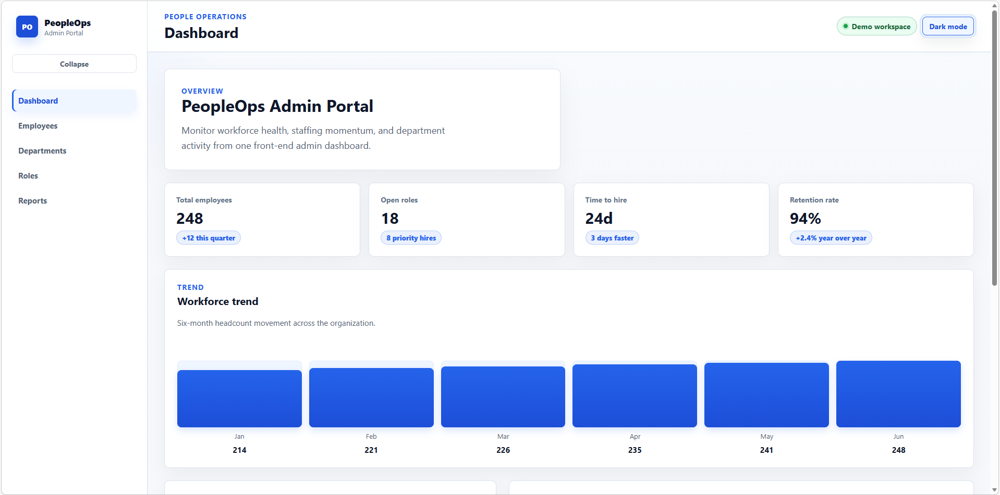
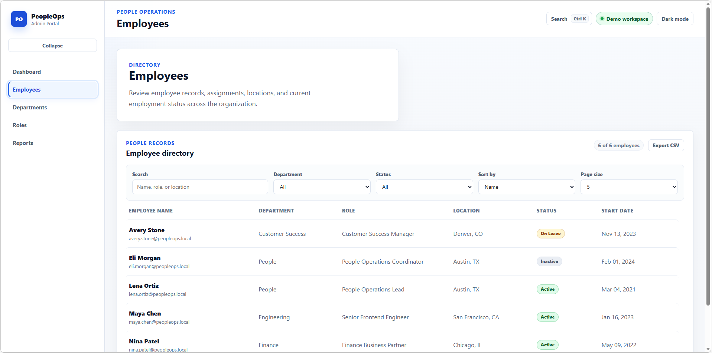
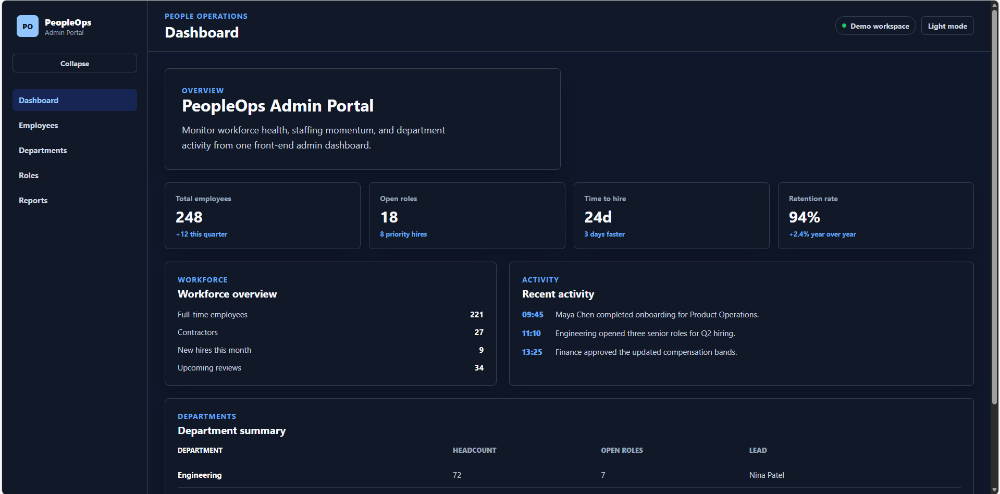

# PeopleOps Admin Portal

[](https://github.com/milanNbg/peopleops-admin-portal/actions/workflows/ci.yml)

A modern, responsive, front-end-only admin dashboard for People Operations and HR management workflows.

PeopleOps Admin Portal is designed as a portfolio-level React application with a professional enterprise SaaS interface, feature-based architecture, mock service layer, accessible navigation patterns and reusable UI components.

## Live Demo

View the deployed app: https://peopleops-admin-portal.vercel.app

## Screenshots

Dashboard light mode



Employees light mode



Dashboard dark mode



## Tech Stack

- React
- TypeScript
- Vite
- React Router
- SCSS
- ESLint
- Vitest
- React Testing Library
- Playwright
- GitHub Actions
- Vercel

## Features

- Dashboard overview with summary metrics, workforce trend visualization and operational activity.
- Employees page with table-based browsing, URL-synced filters, debounced search, sorting, pagination, active filter summary, CSV export and an employee detail panel.
- Departments overview page with summary cards, staffing insights and department detail panel.
- Roles overview page with role, access and permissions matrix information.
- Reports overview page with reporting categories, generated report details, detail panel and CSV download action.
- Responsive app shell with sidebar navigation, top header and semantic layout landmarks.
- Global command palette for quick keyboard-based navigation across the app.
- Sidebar collapse / expand preference with accessible navigation labels and active route state.
- Light and dark theme toggle with localStorage persistence.
- Mock async data flows through a service layer.
- Full-page skeleton loading states, empty states and async error states for data-heavy pages.
- Route-level lazy loading for secondary feature pages.
- Application ErrorBoundary for unexpected rendering failures.
- Not Found route for unknown paths.
- Dynamic document titles for application routes.
- Skip-to-content link and accessible navigation controls.
- Reusable UI components including cards, page headers, section headers, skeletons, status badges and data tables.

## Architecture

The application is front-end only and does not include backend code or real API calls. Data is stored as mock data in `src/data` and accessed through a mock service layer in `src/services`.

The project uses a feature-based structure so each major page keeps its page-specific components, hooks and styles close to the feature. Shared layout components live in `src/components/layout`, reusable UI components live in folder-per-component structure under `src/components/ui`, and domain types live in `src/types`.

Imports use the `@/` TypeScript path alias for shared app layers, which keeps feature and service imports readable as the project grows.

State management is intentionally lightweight:

- `useReducer` is used for feature-level state such as employee filtering and sorting.
- React Context is used for app-level UI preferences such as theme mode and sidebar collapsed state.
- Feature data remains local to pages and is loaded through mock services with reusable async loading helpers.

Styling uses SCSS with a global entry point in `src/styles`, base/theme/accessibility partials, layout-level styles, reusable UI styles and feature-page styles colocated with their pages.

The route layer keeps `/dashboard` as the dashboard route, redirects `/` to `/dashboard`, lazy-loads secondary pages and updates the browser title for each application route.

Tests use Vitest and React Testing Library for reusable UI components, app-level context, hooks, filters and the application ErrorBoundary. Playwright covers focused end-to-end smoke tests for the primary app flows.

## Project Structure

```txt
.github/
  workflows/
e2e/
public/
  screenshots/
src/
  assets/
  components/
    layout/
    ui/
  context/
  data/
  features/
    dashboard/
    departments/
    employees/
    not-found/
    reports/
    roles/
  hooks/
  providers/
  routes/
  services/
  styles/
    base/
    utilities/
  test/
  types/
  utils/
```

## Available Scripts

Install dependencies:

```bash
npm install
```

Run the development server:

```bash
npm run dev
```

Run linting:

```bash
npm run lint
```

Run the test suite:

```bash
npm run test:run
```

Run the test suite with coverage:

```bash
npm run test:coverage
```

Run the end-to-end smoke tests:

```bash
npm run test:e2e
```

Build for production:

```bash
npm run build
```

Preview the production build:

```bash
npm run preview
```

## CI

GitHub Actions runs the project validation workflow on pushes and pull requests targeting `main`.

The CI workflow installs dependencies with `npm ci`, then runs linting, the Vitest test suite, the production build and Playwright E2E smoke tests.

## Purpose

This project demonstrates modern React application development with strong TypeScript usage, reusable component architecture, responsive enterprise dashboard design, maintainable SCSS organization, accessibility-focused navigation, front-end testing, CI validation and production deployment.
